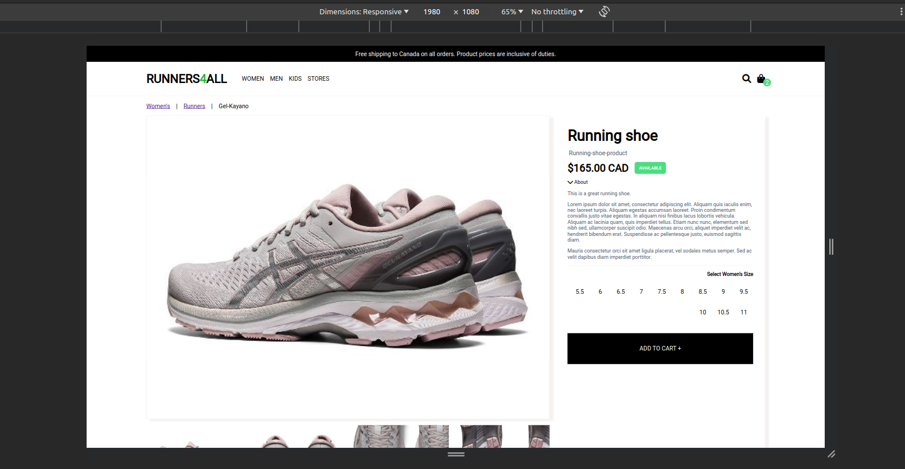
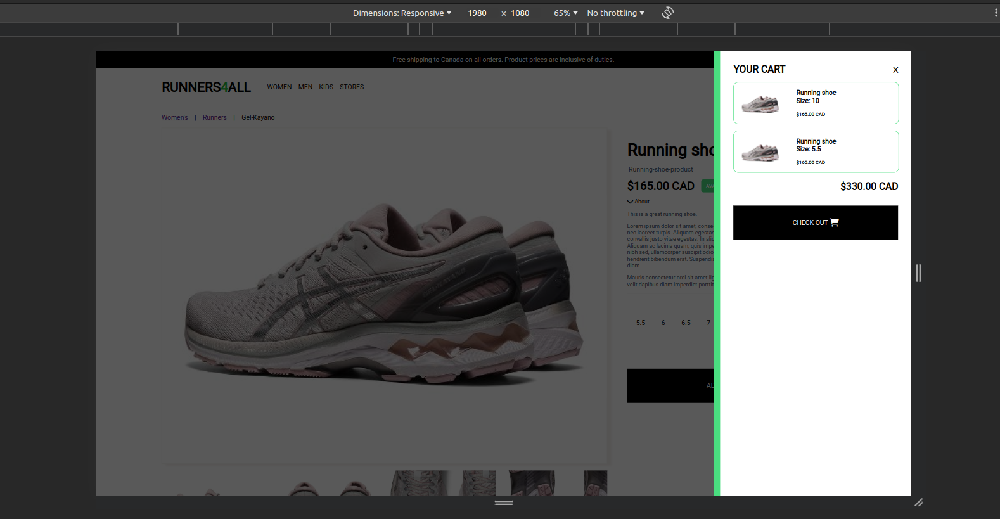

# Shopify Developer Challenge

## Description

### Template file

I started by writing the layout file. In the template document I opted for
having the navbar and the footer abstracted away so I can concentrate only
in the specifically in the item in the product file.

Starting with the template.liquid I:

- Updated the title of the document (adding the fake R4A brand) following SEO practice.

- Added a custom font cdn

- Added font-aweson icons cdn

- Then I added a message that can be updated with new deals

- Added a LOGO, fake links and the cart Icon (to access user's shopping cart)

- Added a minimal footer

In terms of the implemented JS in the template view I:

- Added a function that reloads the shopping cart badge if a new item is added

  - if the value stored is greater than zero I render the value and a green badge

- Next I added a coouple of events to open and closing the modal if the user clicks the shopping cart icon

- I also added a blocker element that darkens the background so the user can concentrate only in the cart information

- Finally, I added a last function that checks the state of the basket list. If there are items in the cart, we iterate over the list and create card for displaying the items accordingly.

- While doing so, I kept track of the grand total and render the value in the shopping cart modal

- If there aren't element in the cart and users opens the cart, a message "No items" message is displayed

### Product file

For the product file I firstly added the template and the focused on making a wireframe for having a basic structure. I opted for a conventional approach of
havin the main section on the right while having the picture on the left side of the screen.

For this view I:

- Added a breadcrumb with mocked links (suggesting the route took by the user)

- I then continue with placing the images. One thing I'd liked to have done here is rendering the images with loop. However, when I realized of this, I think it was already to late for that.

- After images I created the product info section with the proper information. I used liquid syntax to formatted the values accordingly.

- I also added an "AVAILABLE" tag that updated if the available property changes: If the value gets to be false the badge will change to "Out of stock"

-After that I added the description of the product. With it is collapsable. You can hide the information by clicking on it.

-For the different sizes of shoes, I iterate over the sizes property and render selectors accordingly. If a size is selected then I save the size in the client thru localStorage (for future usage during the POST request)

-I added also and "Add to cart" button and attached a function that extracts the selected information and makes a POST request to /cart/add using the fetchAPI. I await the result and if there is a 200 response we:

- I update or store a "cartItems" value in localstorage
- then I trigger a function that renders a toast to the user
- And finally re-render the page to see the changes reflected
- If we received a 500 or any error, we show in the client console for debugging purposes and an alert for the user. In the error I opted for showing just a simple message. However in a real project I'd have rendered the error message (error.response.data.message);

- Finally, I added a function to show or hide a detailed image of the item

### Final comments

Thank you Rocco and Gabriel for considering me for the role. That alone makes me think that I'm on the right track in this field. About the project, my favorite part of doing this was learning about liquid and getting to use vanilla JS again (As I've been working with React for the last year). It was really fun and I'm confident that I can master liquid and it's intrincacies fast enought. Another thing that I think I should mention is that I participated in YYCHacks 2024 over the weekend (Friday to Sunday - a commitment I had already scheduled). So I didnt have much time to work on this.

Thanks again!
